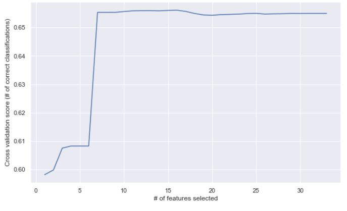
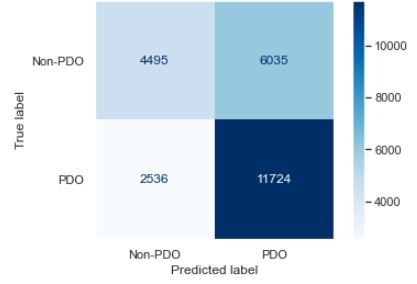
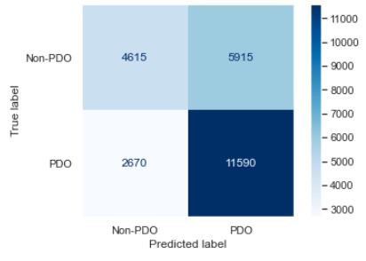
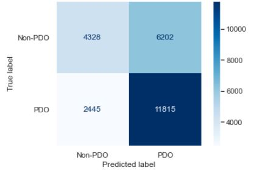

# Identifying Contributing Factors to Collision Severity in Sacramento County, CA.

## 1. Introduction
Each year, more than 40,000 road users get killed on the roadways in the US. Despite considerable advances in the vehicle industry and the safety of occupants, the existing safety trend is yet a major concern. Addressing this trend needs a thorough understanding of collision causes. In other words, identifying the collision causes is one of the major steps towards a successful, data-driven safety enhancement. To this end, we explored the contributing factors to collision and their higher injury severity in Sacramento, CA.

## 2. Data
For this study, we used the collision data in unincorporated Sacramento County for the most recent 5-year period, i.e., 2015 through 2019. The data is publicly available through the SWITRS collision database. A review of the data identifies 99,590 collisions during the study period, out of which 57,040 are found to be property damage only (PDO) collisions and 42,119 are other (non-PDO) collisions. The dataset includes 76 columns, many of them are attributes that do not affect the severity of collisions. The figure below shows clearly that there is no downward trend in the frequency of collisions. This is exactly the issue that we were talking about that needs a close investigation.

Before digging deep into the data analysis portion, we need to prepare the data for analysis and do some preliminary data exploration. This is a major step as the entire analysis depends on this step and how we handle the data. This step for our study is composed of several smaller stapes as below:
- Data Clean-up 
- Initial Data Selection and Exploratory Data Analysis
- Encoding Categorical Variables 
- Final Data selection

### 2.1 Data Clean-up
This step mainly involves removing the categories of no interest under each column (collision attribute) and combining the categories of low frequency that might affect our analysis into a broader category. These categories may include hyphens, NaN (not a number categories) and NAs (not available). 

### 2.2 Initial Data Selection and Exploratory Data Analysis:
The initial dataset has many columns and attributes that several of them may not define the severity of the collisions. By domain knowledge and common sense, we know there are many of these variables that do not affect the collision severity. The attributes that we think might affect the collision severity include the following. We have also prepared the severity distribution of the collisions under each of these attributes and their categories. The presence of varying collision severity across different categories is a sign of the effect of that attribute of collision severity. 
- Day of Week: Based on the figure below, collisions that happened during the weekend seem to be of higher severity.

- Intersection: It seems collisions that happened at intersections do show some variations in collision severity. Collisions at intersections seem to be slightly more severe than those that happened at segments.	

- Weather Condition: It is not clear based on the figure below to claim weather can affect the injury severity. However, historically the weather has played a role in affecting the injury severity, so we will keep it until we investigate it through our models.

- Primary Contributing Factor: This parameter is probably the most affecting and interesting one. Some interesting patterns can be found based on the figure below. For instance, Automobile Right-of-Way disproportionally accounts for higher Non-PDO collisions than PDO.

- Type of Collision: Collision type also clearly explains the difference between PDO and Non-PDO collisions, as can be seen by the figure. 

- Lighting Condition: The lighting condition also seems to be affecting the severity outcome of the collisions, as perceived by the figure below. 

- Alcohol Envolvement: As we can see from the chart above, alcohol involvement seems to affect the severity of collisions. Collisions with alcohol involvement tend to be more severe than those with no alcohol involvement.

### 2.3 Encoding Categorical Variables
The data we are dealing with in this study are all categorical. The SWITRS data encodes the categories for each column (collision attribute) using a different method (alphanumerical codes) that is not proper for machine learning and modeling purposes. To overcome this issue, we use a method called one-hot encoding that expands each column into several columns based on the number of unique categories and assigns a value of 0 or 1 to each cell.  The value of 1, which represents “yes”, is assigned to the collision is that specific category is seen in that collision. For instance, if the category is “Dark Condition” and the collision has occurred during dark condition then this category for that collision takes a value of 1. After this step, we will be left with a table with all values of 0 and 1. 

### 2.4 Final Data Selection
Even under the initially selected attributes, there might be several categories that might not affect the collision severity considerably. The inclusion of these categories will just increase the complexity of the model and takes the computational power and time. Therefore, it is a good practice to employ a method that can help us reduce the dimensionality of the dataset. One of the methods “Recursive feature elimination with cross-validation” or RFECV. Employing this method helped us get rid of the categories that may be of less importance when it comes to determining collision severity. RFECV identified 12 categories that, combined in a model, can achieve the highest score and best determine the collision severity. The figure below shows a chart depicting the addition of various features and their effect on the cross-validation score. More information about this method can be found [here](https://scikit-learn.org/stable/modules/feature_selection.html#rfe).

## 3. Methodology
### 3.1 Model Identification
In this study, we considered three models to fit the data. These models include:
- Logistic Regression
- Decision Tree Analysis
- kNN
Each of these models has its own hyperparameters that need to be tuned to get the best result out of them. This process needs a method, called the grid search. The way it works is that we identify the hyperparameters that we want to explore for each of the models and then run each model using those hyperparameters. For each model, we then get a set of hyperparameter(s) that help us achieve the best results for that specific model. 

### 3.2 Model Evaluation Metrics
Now that we have the best hyperparameters for each of the selected models, the next step is to compare the best of these models against each other and come up with the winning model that outperforms the others. The confusion matrix is a well-known tool to assess and evaluate the performance of classification methods. The tool can help calculate several metrics such as precision and recall. In this problem, we do care about both correctly predicted positive cases (Non-PDO) and negative cases (PDO), hence we suggest combining precision and recall. The combination of these two metrics is feasible through the calculation of the f1-score. Furthermore, accuracy, calculated as the total number of correctly predicted classes divided by total sample size is another important metric we would like to calculate and consider.

## 4. Results
Now that we know the best hyperparameters for each model and have identified our performance evaluation metrics, we need to develop the models, one by one, using the hyperparameters and calculate the performance metrics. 

### 4.1 Logistic Regression
Through the implementation of the hyperparameter tuning practice and identification of the best parameters, we developed a logistic regression model and calculated the performance evaluation metrics. These metrics, calculated using the confusion matrix (depicted below) are as follows:

Severity Level|Precision|Recal|f1-score
------------|------------|---------|---------
Non-PDO     |  0.64      |   0.43  |    0.51  
PDO         |  0.66      |   0.82  |    0.73    

Accuracy of the Model |0.65 
---|---

### 4.2 Decision Tree Analysis
Through the implementation of the hyperparameter tuning practice and identification of the best parameters, we developed a decision tree analysis model and calculated the performance evaluation metrics. These metrics, calculated using the confusion matrix (depicted below) are as follows:

Severity Level|Precision|Recal|f1-score
------------|------------|---------|---------
Non-PDO     |  0.63      |   0.44  |    0.52  
PDO         |  0.66      |   0.81  |    0.73    

Accuracy of the Model |0.65 
---|---

### 4.3 k-Nearest Neighbor
Through the implementation of the hyperparameter tuning practice and identification of the best parameters, we developed a kNN model and calculated the performance evaluation metrics. These metrics, calculated using the confusion matrix (depicted below) are as follows:

Severity Level|Precision|Recal|f1-score
------------|------------|---------|---------
Non-PDO     |  0.64      |   0.41  |    0.50  
PDO         |  0.66      |   0.83  |    0.73    

Accuracy of the Model |0.65 
---|---

