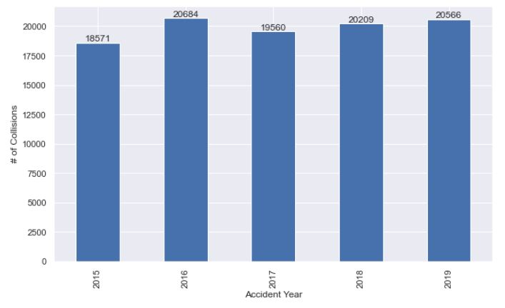
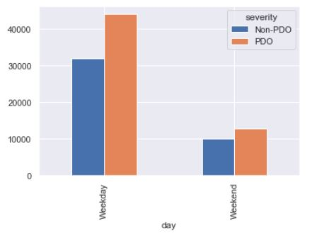
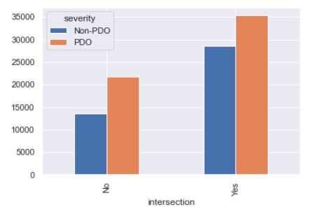
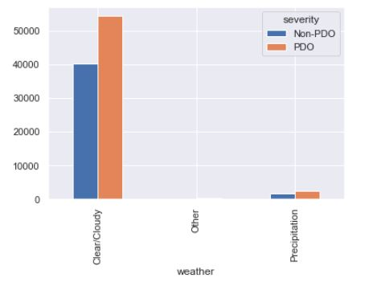
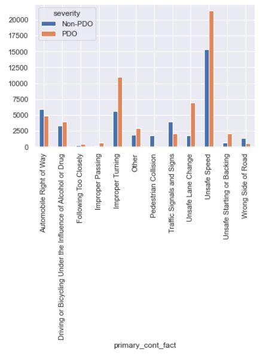
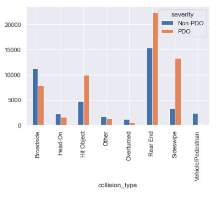
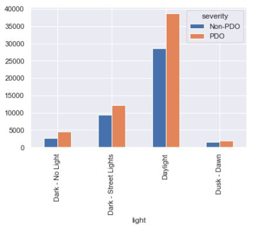
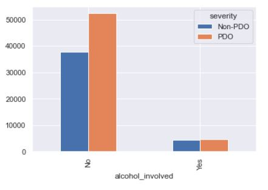

# Identifying Contributing Factors to Collision Severity in Sacramento County, CA.

## 1. Introduction
Each year, more than 40,000 road users get killed on the roadways in the US. Despite considerable advances in the vehicle industry and the safety of occupants, the existing safety trend is yet a major concern. Addressing this trend needs a thorough understanding of collision causes. In other words, identifying the collision causes is one of the major steps towards a successful, data-driven safety enhancement. To this end, we explored the contributing factors to collision and their higher injury severity in Sacramento, CA.

## 2. Data
For this study, we used the collision data in unincorporated Sacramento County for the most recent 5-year period, i.e., 2015 through 2019. The data is publicly available through the SWITRS collision database. A review of the data identifies 99,590 collisions during the study period, out of which 57,040 are found to be property damage only (PDO) collisions and 42,119 are other (non-PDO) collisions. The dataset includes 76 columns, many of them are attributes that do not affect the severity of collisions. The figure below shows clearly that there is no downward trend in the frequency of collisions. This is exactly the issue that we were talking about that needs a close investigation.

Before digging deep into the data analysis portion, we need to prepare the data for analysis and do some preliminary data exploration. This is a major step as the entire analysis depends on this step and how we handle the data. This step for our study is composed of several smaller stapes as below:
- Initial Data Selection and Exploratory Data Analysis
- Data Clean-up 
- Encoding Categorical Variables 
- Final Data selection

### 2.1 Initial Data Selection and Exploratory Data Analysis:
The initial dataset has many columns and attributes that several of them may not define the severity of the collisions. By domain knowledge and common sense, we know there are many of these variables that do not affect the collision severity. The attributes that we think might affect the collision severity include the following. We have also prepared the severity distribution of the collisions under each of these attributes and their categories. The presence of varying collision severity across different categories is a sign of the effect of that attribute of collision severity. 
- Day of Week: 

- Intersection

- Weather Condition

- Primary Contributing Factor

- Type of Collision

- Lighting Condition

- Alcohol Envolvement

### 2.2 Data Clean-up
This step mainly involves removing the categories of no interest under each column (collision attribute) and combining the categories of low frequency that might affect our analysis into a broader category. These categories may include hyphens, NaN (not a number categories) and NAs (not available). 

### 2.3 Encoding Categorical Variables
The data we are dealing with in this study are all categorical. The SWITRS data encodes the categories for each column (collision attribute) using a different method (alphanumerical codes) that is not proper for machine learning and modeling purposes. To overcome this issue, we use a method called one-hot encoding that expands each column into several columns based on the number of unique categories and assigns a value of 0 or 1 to each cell.  The value of 1, which represents “yes”, is assigned to the collision is that specific category is seen in that collision. For instance, if the category is “Dark Condition” and the collision has occurred during dark condition then this category for that collision takes a value of 1. After this step, we will be left with a table with all values of 0 and 1. 

### 2.4 Final Data Selection

